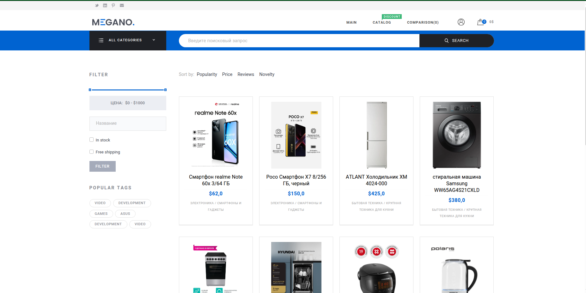

# Проект электронного магазина на фреймворке Django.

## Описание проекта

В проекте реализован полноценный электронный магазин, с возможностью авторизации пользователей, административной секцией,
в которой можно выполнять все административные функции по управлению магазином. Так же реализовано кэширование с
использованием "redis". Так же реализован тестовый сервис оплаты товара с использованием
Юкасса.

## Для запуска проекта необходимо выполнить следующие действия:

- [ ] скачиваем проект из репозитория командой **git clone https://github.com/Artromterra/Django_project.git**
- [ ] создать файл .env по образцу .env.example
- [ ] запустить в консоли команду **docker compose up --build**
- [ ] приложение доступно по адресу http://0.0.0.0:8080
- [ ] в проекте есть фикстуры с данными продуктов, для их установки в консоли контейнера ``online_store_app`` из директории ``online_store``, где находится файл manage.py
выполнить команду **uv run manage.py load_fixtures**. Данная команда создаст необходимые миграции и наполнит базу данных необходимыми данными
- [ ] по умолчанию созданы пользователи: 
    <ul>
        <li>логин: admin@admin.ru, пароль: admin</li>
        продавцы:
        <li>логин: worldberries@mail.ru, пароль: 7dg89568</li>
        <li>логин: seller2@mail.ru, пароль: semenov</li>
        пользователь:
        <li>логин: sergeev@mail.ru, пароль: sergeev</li>
    </ul>